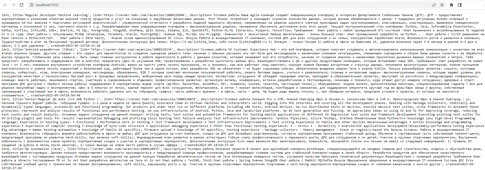
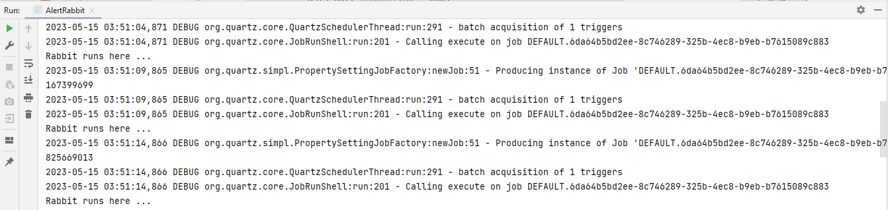

# job4j_grabber

# About

- This application is a vacancy aggregator (Grabber app)
- The system starts according to the schedule - once a minute
- The program reads all Java vacancies from website "habr.career.com" and writes them to the database
- This application also contains an individual example of tasks' periodic execution (AlertRabbit app)

***

# Used technologies

<ul>
 <li>JDK 17</li>
 <li>Maven 3.8.5</li>
 <li>Quartz 2.3.2</li>
 <li>Jsoup 1.15.3</li>
 <li>JDBC 4</li>
 <li>PostgreSQL 42.2.27</li>
</ul>

***

# Grabber environment requirements

<ul>
 <li>Create db "post". Login: postgres, password: password</li>
 <li>Add the following script:

    create table post(  
    id serial primary key,  
    name varchar(255),  
    text text,  
    link varchar(255) unique,  
    created timestamp  
    );
 </li>
 <li>Create .jar file via maven command "mvn package"</li>
 <li>Go to the Target folder and check the presence of "job4j_grabber-1.0-SNAPSHOT.jar" file</li>
 <li>Open the command line, go to the Target folder</li>
 <li>Run this file through "java -jar job4j_grabber-1.0-SNAPSHOT.jar" command</li>
 <li>Go to http://localhost:9000</li>
 <li>List of collected posts:</li>
</ul>

  

***

# AlertRabbit environment requirements

<ul>
 <li>Create db "rabbit". Login: postgres, password: password</li>
 <li>Add the following script:

    create table rabbit(
    id serial primary key,
    created_date timestamp
    );
 </li>
 <li>Change the "mainClass" in maven-shade-plugin to "ru.job4j.quartz.AlertRabbit"</li>
 <li>Create .jar file via maven command "mvn package"</li>
 <li>Go to the Target folder and check the presence of "job4j_grabber-1.0-SNAPSHOT.jar" file</li>
 <li>Open the command line, go to the Target folder</li>
 <li>Run this file through "java -jar job4j_grabber-1.0-SNAPSHOT.jar" command</li>
 <li>The job is performed periodically (console):</li>
</ul>

***

# Todo list

- Add to the project the support of new websites without changing the code
- Implement parallel parsing of websites
- Cover the code to unit tests

***

# Contact

Contact me if you have any questions: itfedorovsa@gmail.com

                                                                    
                                                                         
                                                                            
                                                                                
                                                                           
